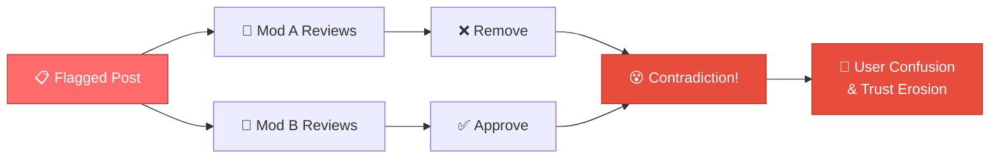
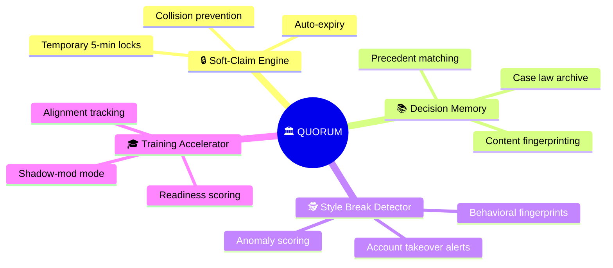
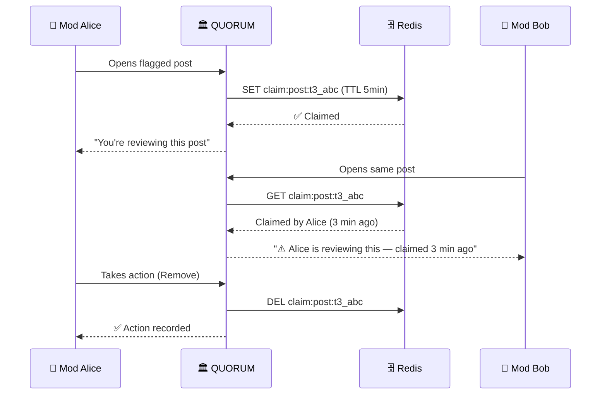
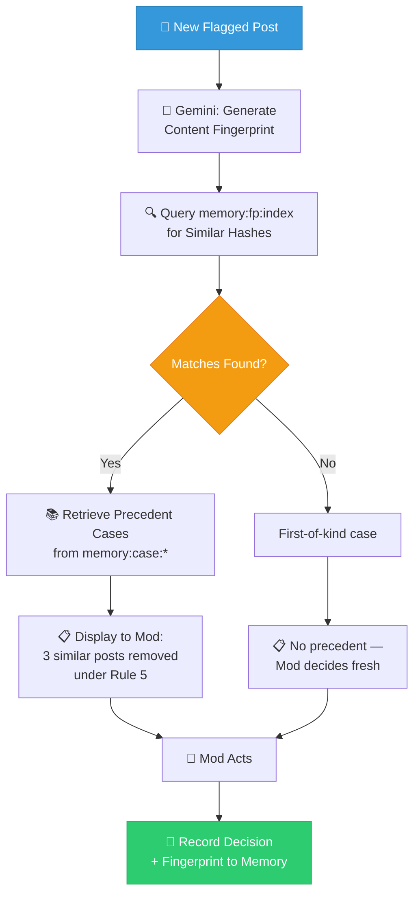
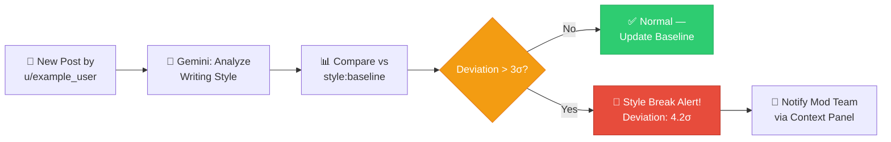
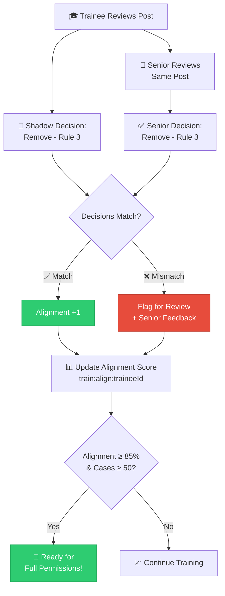
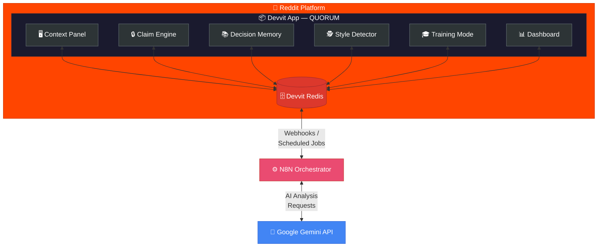
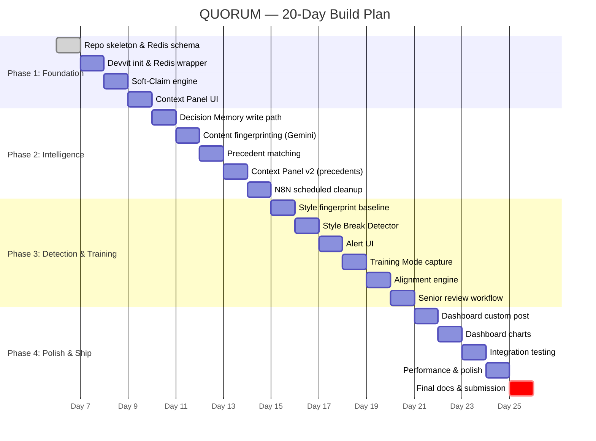

<p align="center">
  <h1 align="center">🏛️ QUORUM</h1>
  <p align="center"><strong>The Collective Intelligence Layer for Reddit Moderation</strong></p>
  <p align="center">
    <em>Stop moderating alone. Start moderating as a system.</em>
  </p>
</p>

<p align="center">
  <a href="#the-problem">Problem</a> •
  <a href="#the-solution">Solution</a> •
  <a href="#tech-stack">Tech Stack</a> •
  <a href="#roadmap">Roadmap</a> •
  <a href="#installation">Installation</a> •
  <a href="#license">License</a>
</p>

---

## The Problem

Moderating a subreddit at scale is a coordination nightmare. Today's mod teams face three systemic failures:



### 🔄 Mod Collisions
Two moderators open the same flagged post. Both investigate. Both act—sometimes contradicting each other. There is no "lock" on mod work, leading to **duplicated effort and inconsistent outcomes**.

### 🧠 Institutional Amnesia
A mod removes a post for violating Rule 3. Six weeks later, a nearly identical post appears. A different mod approves it. The team has **no shared memory** of past decisions, so enforcement drifts over time, eroding community trust.

### ⏱️ Context-Hunting Time Sinks
Before acting on a report, a mod must manually open a user's profile, scroll through history, check previous warnings, and look for behavioral patterns. This **context-gathering takes 2–5 minutes per case**, adding up to hours of lost time daily in high-traffic subreddits.

---

## The Solution

**QUORUM** transforms a disconnected group of individual moderators into a synchronized, learning system. It sits inside the Reddit experience via Devvit and provides four core capabilities:



### 🔒 Soft-Claim Engine
When a moderator begins reviewing a post, QUORUM places a **temporary 5-minute claim** on it, visible to all other mods. This eliminates collisions without hard-locking content. Claims auto-expire if the mod moves on, and can be extended or released manually.



> *"Alice is reviewing this — claimed 2 min ago"*

### 📚 Decision Memory (Case Law)
Every mod action—approve, remove, warn—is recorded alongside the content fingerprint, the rule invoked, and the moderator's rationale. When a similar post appears in the future, QUORUM surfaces **relevant precedents** so the current mod can see how the team has handled analogous cases. This creates a living, searchable "case law" for the subreddit.



> *"3 similar posts were removed under Rule 5 in the last 90 days. Tap to view."*

### 🕵️ Style Break Detector
QUORUM maintains a lightweight **behavioral fingerprint** for frequent posters—average sentence length, vocabulary diversity, posting cadence, and topic distribution. When a post deviates significantly from a user's established baseline, it flags a potential **account takeover or bot compromise**, giving mods an early-warning system that no amount of manual review could replicate.



> *"⚠️ Style anomaly detected: This post's writing pattern deviates 4.2σ from u/example_user's baseline."*

### 🎓 New Mod Training Accelerator
Junior mods enter a **shadow-mod training mode** where they make decisions on real content without those decisions taking effect. Their choices are recorded and compared against the actual decisions made by senior moderators. Over time, QUORUM tracks alignment and generates a readiness score, letting the team know when a trainee is ready for full permissions.



> *"Trainee alignment: 87% match with senior decisions over the last 50 cases."*

---

## Tech Stack

| Layer | Technology | Role |
|---|---|---|
| **Platform** | [Reddit Devvit](https://developers.reddit.com) (TypeScript/React) | App shell, UI components, Reddit API access |
| **State** | Devvit Redis Plugin | All persistent state — claims, memory, fingerprints |
| **Orchestration** | [N8N](https://n8n.io/) | Off-chain workflows, scheduled jobs, webhook routing |
| **AI** | [Google Gemini API](https://ai.google.dev/) | Content fingerprinting, style analysis, precedent matching |

### Architecture Overview



### Data Flow

```mermaid
flowchart LR
    A["📋 Reported Post"] --> B["🔒 Claim Check"]
    B --> C["📊 Context Panel\nLoads History"]
    C --> D["🤖 Gemini Analysis\nvia N8N"]
    D --> E["📚 Precedent\nLookup"]
    E --> F["👤 Mod Decision"]
    F --> G["💾 Record to\nDecision Memory"]
    G --> H["📈 Update User\nReputation"]
    H --> I["🔓 Release Claim"]

    style A fill:#e74c3c,stroke:#c0392b,color:#fff
    style D fill:#4285f4,stroke:#3367d6,color:#fff
    style F fill:#f39c12,stroke:#e67e22,color:#fff
    style I fill:#2ecc71,stroke:#27ae60,color:#fff
```



---

## Roadmap

### 20-Day Build Plan



#### Phase 1: Foundation (Days 1–4)
- [x] **Day 1** — Repository skeleton, README, Redis schema design, `.gitignore`, LICENSE
- [ ] **Day 2** — Devvit project initialization, Redis client wrapper, key helper utilities
- [ ] **Day 3** — Soft-Claim engine: `claimPost()`, `releaseClaim()`, `checkClaim()` with 5-min TTL
- [ ] **Day 4** — Context Panel UI: display active claims, author history summary, inline mod actions

#### Phase 2: Intelligence (Days 5–9)
- [ ] **Day 5** — Decision Memory write path: capture mod actions with content hash + rule ID
- [ ] **Day 6** — Content fingerprinting pipeline: Gemini integration for semantic hashing
- [ ] **Day 7** — Precedent matching: query Decision Memory for similar past cases
- [ ] **Day 8** — Context Panel v2: surface precedent cards with "How was this handled before?"
- [ ] **Day 9** — N8N workflow: scheduled memory compaction and stale-entry cleanup

#### Phase 3: Detection & Training (Days 10–15)
- [ ] **Day 10** — Style fingerprint baseline: compute per-author behavioral vectors via Gemini
- [ ] **Day 11** — Style Break Detector: deviation scoring and anomaly threshold tuning
- [ ] **Day 12** — Alert UI: style-break warnings in the Context Panel
- [ ] **Day 13** — Training Mode: shadow-decision capture for junior mods
- [ ] **Day 14** — Alignment engine: compare trainee vs. senior decisions, compute readiness score
- [ ] **Day 15** — Senior review workflow: approve/reject trainee decisions with feedback

#### Phase 4: Polish & Ship (Days 16–20)
- [ ] **Day 16** — Dashboard custom post: mod team overview, claim activity, decision stats
- [ ] **Day 17** — Dashboard charts: alignment trends, collision rate, style-break alerts over time
- [ ] **Day 18** — End-to-end integration testing on a private subreddit
- [ ] **Day 19** — Performance profiling, Redis key optimization, UI polish
- [ ] **Day 20** — Final documentation, demo recording, hackathon submission

---

## Installation

> **⚠️ Prerequisites:** Node.js 18+, a Reddit account with mod access, and the Devvit CLI.

### 1. Install Devvit CLI & Authenticate

```bash
npm install -g devvit
devvit login
```

### 2. Clone & Install Dependencies

```bash
git clone https://github.com/Anbu-00001/Context_hunting.git
cd Context_hunting
npm install
```

### 3. Configure Environment

```bash
cp .env.example .env
# Fill in your Gemini API key and N8N webhook URLs
```

### 4. Start Playtest

```bash
devvit playtest <your-test-subreddit>
```

> 📝 *Detailed installation and configuration guides will be added as modules are completed.*

---

## Project Structure

```mermaid
graph TD
    Root["📁 Context_hunting/"] --> Src["📁 src/"]
    Root --> Docs["📁 docs/"]
    Root --> N8N_Dir["📁 n8n/"]
    Root --> Config["📄 Config Files"]

    Src --> Main["📄 main.ts\nDevvit entry point"]
    Src --> Components["📁 components/\nContext Panel, Dashboard"]
    Src --> Engines["📁 engines/\nClaims, Memory, Style, Training"]
    Src --> RedisDir["📁 redis/\nKey helpers & client wrapper"]
    Src --> Types["📁 types/\nTypeScript interfaces"]

    Docs --> Schema["📄 redis_schema.md"]
    Docs --> Arch["📄 architecture.md"]

    N8N_Dir --> Workflows["📄 Workflow JSONs"]

    Config --> Env["📄 .env.example"]
    Config --> GI["📄 .gitignore"]
    Config --> Lic["📄 LICENSE"]
    Config --> Readme["📄 README.md"]
    Config --> Pkg["📄 package.json"]
    Config --> TS["📄 tsconfig.json"]

    style Root fill:#ff4500,stroke:#cc3700,color:#fff
    style Src fill:#1a1a2e,stroke:#16213e,color:#fff
    style Docs fill:#1a1a2e,stroke:#16213e,color:#fff
    style Engines fill:#2d3436,stroke:#636e72,color:#fff
    style Components fill:#2d3436,stroke:#636e72,color:#fff
    style RedisDir fill:#dc382c,stroke:#a52a2a,color:#fff
```



```
Context_hunting/
├── src/
│   ├── main.ts              # Devvit app entry point
│   ├── components/           # UI components (Context Panel, Dashboard)
│   ├── engines/              # Core logic (Claims, Memory, Style, Training)
│   ├── redis/                # Redis key helpers and client wrapper
│   └── types/                # TypeScript interfaces and types
├── docs/
│   ├── redis_schema.md       # Redis key-value architecture
│   └── architecture.md       # System design docs (coming soon)
├── n8n/                      # N8N workflow export JSONs
├── .env.example              # Environment variable template
├── .gitignore
├── LICENSE
├── README.md
├── package.json
└── tsconfig.json
```

---

## Contributing

QUORUM is currently in active hackathon development. Contributions, feedback, and ideas are welcome after the initial submission period. Please open an issue to discuss any changes.

---

## License

This project is licensed under the **MIT License** — see the [LICENSE](LICENSE) file for details.

---

<p align="center">
  <sub>Built with ☕ and conviction for the <strong>Reddit Mod Tools Hackathon 2026</strong></sub>
</p>
